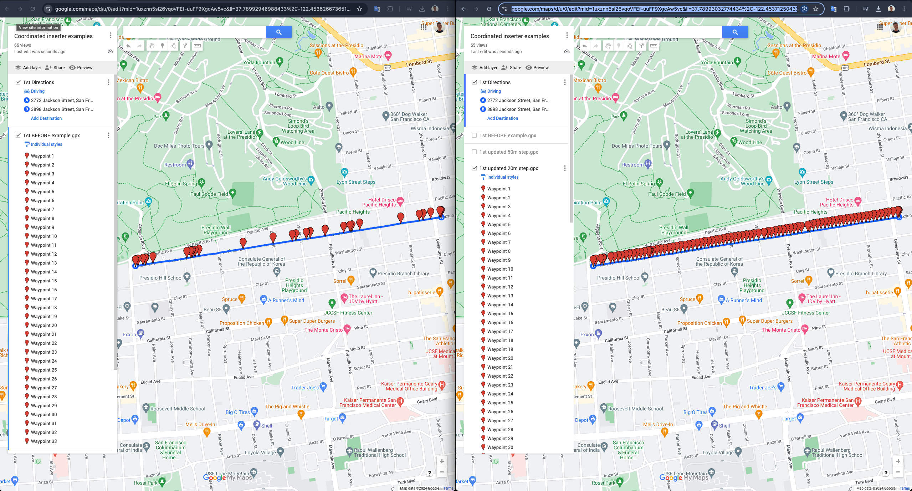
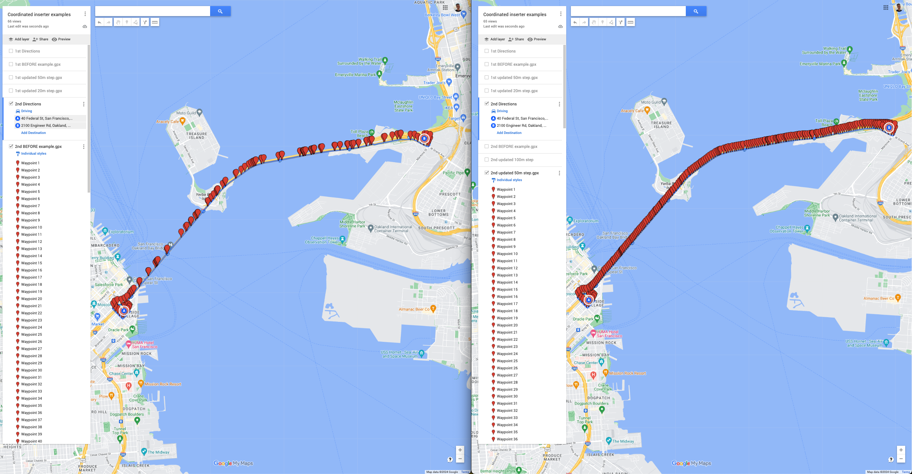

# Is your location simulation is speedy or 'jumpy'?

- GPX files generated via Google maps ([My maps](https://www.google.com/maps/d/u/0/edit?mid=1uxznn5sl26vqoVFEf-uuFF9XgcAw5vc&usp=sharingto)) tool could be 'Glitchy' in a location simulation via xCode. Sometimes driver's puck is driving way too fast on some segments of your simulation, sometimes it even jumps between subsequent locations instead of driving smoothly. It could happen due to a poor amount of WPT on your routeline. Often it happens on straight highways. Examples:

- One way to smooth your location using such GPX files is to add more WPTs on the routeline to not let Driver's puck jump between long-distanced WPTs. It's very inconvenient doing it manually, and also - it takes a lot of time, so there's a tool, that will get your GPX file, and return an updated GPX file containing more WPTs on the route without losing quality - [WaypointInserter](https://github.com/DiadiukAntony/WaypointInserter).

# Before → After WaypointInserter

You can check the results yourself at [My maps page](https://www.google.com/maps/d/u/0/edit?mid=1uxznn5sl26vqoVFEf-uuFF9XgcAw5vc&usp=sharingto). I'll post more as I'll use this tool more.

And here is the video how it affects navigation. Left side - BEFORE gpx file, navigation look jumpy and speedy, Right side - AFTER gpx file, which looks smooth.

# How to run WaypointsInserter

1. Download [WaypointsInserter](https://github.com/DiadiukAntony/WaypointInserter) from github & open via xCode (or simply use _Open with xCode_ option).
2. Put your input GPX file that you want to enrich in the Downloads folder and rename it to **inserter.gpx**.
3. Run WaypointsInserter xCode app. It will ask for Finder permissions - Allow them. It's just to read your **inserter.gpx** & write output to the Downloads folder.
4. Check **updated.gpx** file appeared in your Downloads folder. That's it!

Feel free to check the Video (same steps recorded):

**NOTE:** You can change the Step variable to regulate the amount of WPTs you need. By default, it's **50m**, which means - the app will add WPTs for each **50m**. If it's too much for your purposes - you can change it to 100m, or if you'll need more waypoints (for a lower Puck's speed) - use 20 / 10m. The Step variable is present on line #4 of _main.swift_ file.

# How WaypointsInserter works

For now - it's a public Github repo, 100% swift coded. All logic is stored in _main.swift_ (it's Anton Diadiuk's TODO to improve the code, split different logic and algorithms into separate files)

1. At first - it reads your **inserter.gpx** file, converts it to a string and via REGEX - it reads Waypoint's Lat & Long => Store them to an _CLLocationCoordinate2D_ array to work on it further.
2. Then, the app takes a pair of WPTs (like WPT#1 & WPT#2 taking WPT#1 as START & WPT#2 as END), then the App interpolates from START to END by creating intermediate on a distance (STEP) == **50m** by default.
3. The app iterates for each pair of WPT's from the beginning of **inserter.gpx** to its last WPT, resulting in an enriched _CLLocationCoordinate2D_ array.
4. Last step - the app converts the resulted array into a GPX file, by adding corresponding Syntax, and writes it to the updated.gpx file.
